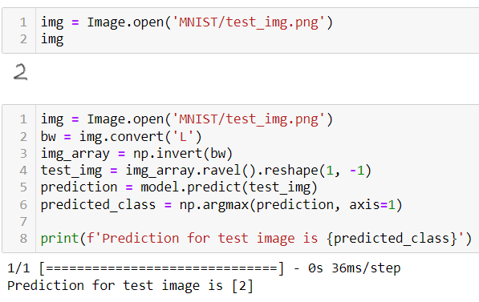

# Math Jungle - recognizing handwritten digits on a website with Tensorflow
 
__Project Objectives:__
- use Tensorflow to create a neural network model to recognize numbers from images of handwritten numbers
- apply this model on a website to recognize numbers written by the website user with a cursor.

Check out the final website hosted on GitHub pages [here](https://athielenhaus.github.io/Handwriting-Recognition-with-Tensorflow/)! For hosting purposes, a seperate [web page branch](https://github.com/athielenhaus/Handwriting-Recognition-with-Tensorflow/tree/webpage_branch) was created which only contains the files required by the web app. 

__Primary tools used:__
- Jupyter Notebook operating in Conda Environment (also experimented with Google Colab Notebook to test training with GPU)
- for Model Development: Python, Tensorflow and Keras
- for Website Development and Model Deployment: Javascript, HTML, CSS, Tensorflow.js
- for Image Preprocessing: OpenCV

## Model Development:
For this project, the well-known [MNIST dataset of handwritten digits](https://en.wikipedia.org/wiki/MNIST_database) was used. The dataset includes a training set of 60,000 images and test set of 10,000 images. The data is provided in CSV format.

The steps taken included:  
- Scale images and one-hot encode target values
- Split training data into training and validation (validation set size = 10,000)
- Setup neural network, including defining layers, activation functions and hyperparameters
- Define batch size and train model
- Evaluate accuracy and test prediction with sample image

#### Model Architecture  
The model architecture involves the following:  
- Input layer: size 784, corresponding to the size of the images (28 x 28)
- 2 hidden dense layers with relu activation and a dropout layer (20%) in between. The first hidden layer has a size of 512 neurons and the second a size of 64. 
- Output layer: dense layer with softmax activation and a size corresponding to the number of classes (10).

The architecture is visualized in the diagram below:  

#### Model Evaluation  
The model achieved a high accuracy on the test set, > 0.98. Therefore, no additional time was invested in further tuning the model. The screenshot below shows the testing of the model on a sample image.  

## Website Development, Image Processing with OpenCV and Model Deployment:
This part of the project involved creating an online Math game in which the user must solve simple Math problems. The user must add up the two indicated numbers and write the response on a canvas using the mouse as "chalk". 

The steps include:
- translate the saved ML model to tensorflow.js - due to the different dependencies of the tensorflowjs library, the conversion required a different environment than the training
- create a UI to display the math question and provide a canvas and submit button to get user input
- use OpenCV to create an image from the user input and preprocess it in the same manner as the other images in the training dataset, i.e.
  - apply grayscale
  - increase contrast
  - determine contours, wrap them in a rectangle and crop empty areas
  - determine the center of mass of the cropped image, center the image and add padding 
  - normalize / scale
- submit image to model to generate a prediction
- add gaming logic, i.e. compare prediction with correct answer, track score and add bells and whistles in the form of plant images

## Conclusion and Learnings
Besides being a good review of neural network architecture and implementation, the project was rewarding in a number of additional ways:
- I used a Jupyter Notebook operating in a Conda environment to create the Tensorflow model. This was convenient in that I did not have to worry about the internet connection and reuploading resources everytime I used the notebook. However, experimenting with Google Colab Notebooks was also interesting, as all the tools needed for this project were already preinstalled, and using the free GPU resources I was able to train the model in only 30 seconds, significantly faster than on my CPU. The main drawback was having to reupload the data, which was very slow. 
- Tensorflow 2.0. The tutorial from the Udemy course was somewhat outdated so that it employed TF 1.x code. As I had installed the most recent TF library, I decided to translate the old code provided by the tutorial into TF 2.x code. This allowed me to compare the two and clearly see how much simpler the TF 2.x library is.
- Online model deployment and using JavaScript: this was the first project in which I deployed an ML model to be used on a live website, also the first project in which I wrote scripts in JavaScript and used the Google Developer console for debugging. I found JS surprisingly simple to navigate using my Python knowledge.
- OpenCV: while I had worked with TF and images previously, this was the first time using OpenCV and doing extensive image preprocessing prior to submitting the images to a model

## Next Steps
One could add a layer of complexity to the game by increasing the number of possible digits. For example, the user could be asked a math question such as "45 + 23" and would write "68" as a response. In this scenario, the image preprocessing would have to include an additional step where the contours of more than 1 object must be detected and each object would subsequently have to be wrapped, cropped, centered, padded and scaled separately. 

Thanks for reading! Special thanks goes out to the team at Appbrewery for providing interesting projects in their Udemy course. 
In case of questions or comments, please do not hesitate to drop me a line at arne.thielenhaus@gmail.com.
